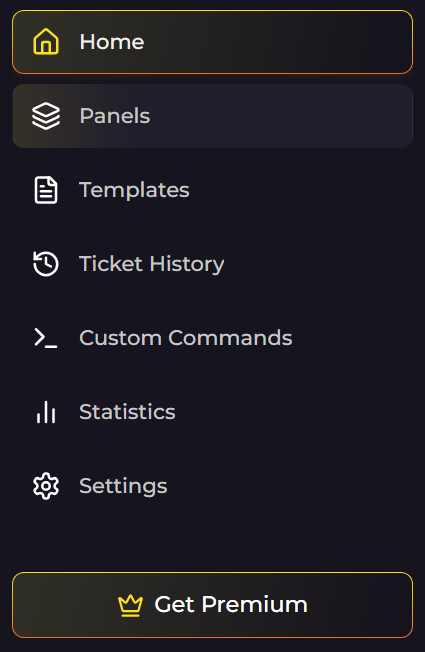

Before reading this, read this one.

[Step by step on how to create a ticket panel](https://github.com/igakojp/Ticket-King/blob/main/Step%20by%20step%20on%20how%20to%20create%20a%20ticket%20panel.md)

---

First thing first, you go into the panel section.

You should find it in the sidebar.

It should show your panel, so click on `Edit` to show everything you can do with the panel setting.

This is the main place to edit the panel.

---

Now, here is the list of things you can do.
[Add Embed](https://github.com/igakojp/Ticket-King/new/main#add-embed)

---

# Add Embed

# Buttons & Select Menu
