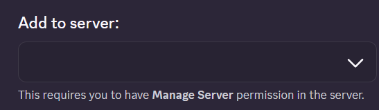

Let's say that you already own a Discord server.

If you don't own one, please look at this document to find out how to make one:  
https://support.discord.com/hc/en-us/articles/204849977-How-do-I-create-a-server

---

First thing first, open this link:  
https://discord.com/oauth2/authorize?client_id=710034409214181396&scope=bot&permissions=534992383065

Scroll down until you get to the bottom.

There should be `Add to Server` at the bottom, and a select button under it.

Select the server you want to add the bot into, and click on `Continue`.

After that, do not click on anything other than the `Authorize` button.

You are done.
